<div align="center">

# VideoContext

### The open-source semantic layer for video

Turn video into timestamped, searchable context for AI agents and applications.

<br />

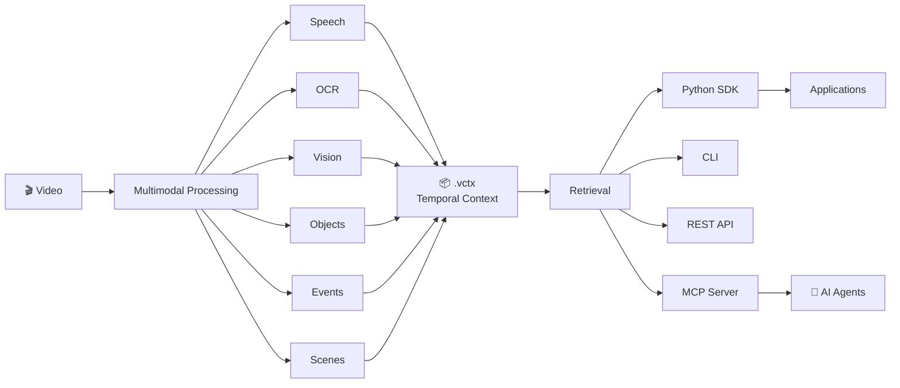

<br />

**Process once. Query repeatedly. Keep every result connected to the moment it came from.**

<br />

[Quick Start](#quick-start) · [Python SDK](#python-sdk) · [CLI](#cli) · [REST API](#rest-api) · [MCP Server](#mcp-server) · [Architecture](docs/ARCHITECTURE.md) · [`.vctx` Format](docs/VIDEO_CONTEXT_SPEC.md) · [Roadmap](docs/ROADMAP.md)

</div>

---

## Why VideoContext?

Modern AI systems can understand images and, increasingly, video. What is still needed is an infrastructure layer that turns video into **structured, reusable context**.

Video contains multiple kinds of information at the same time:

* What was said
* What appeared on screen
* What objects were visible
* What events occurred
* When each piece of information occurred

A transcript alone loses visual information.

OCR alone loses speech.

Individual frame descriptions can lose the temporal relationship between information.

VideoContext processes video into timestamped context that can be searched, queried, exposed through APIs, and made available to AI agents.

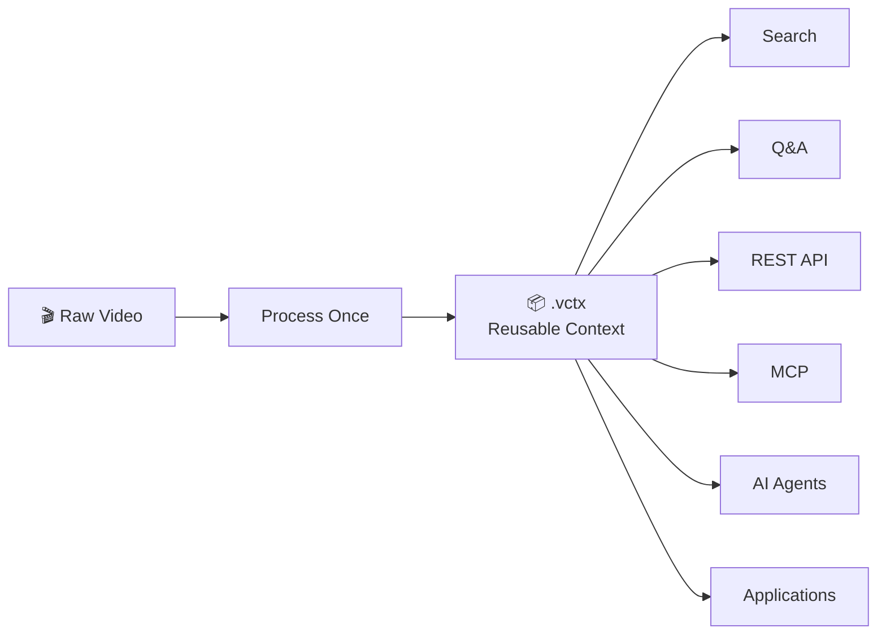

The goal is simple:

> **Make video information as searchable and reusable as text while preserving when and where that information occurred.**

---

# Features

## 🎬 Video Processing

VideoContext includes infrastructure for processing video and extracting temporal information.

The project contains components for:

* Video ingestion
* FFmpeg media inspection
* Metadata extraction
* Frame sampling
* Scene detection
* Speech processing
* OCR
* Vision processing
* Object information
* Event extraction
* Temporal segmentation

---

## 📦 Temporal Context

Processed information is represented using the `.vctx` format.

The core model is:

```text
Information
+
Timestamp
+
Modality
+
Evidence Reference
```

This means extracted information remains connected to the part of the video it originated from.

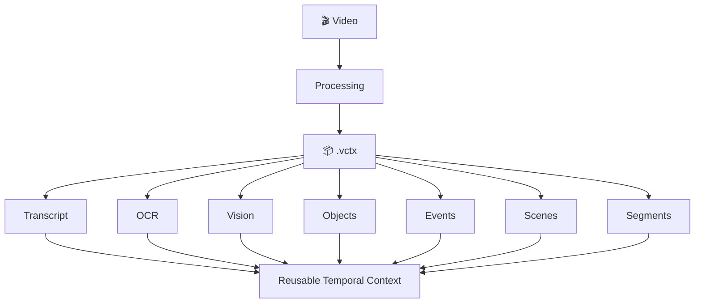

---

## 🔎 Search and Retrieval

VideoContext provides retrieval over processed video context.

The project includes support for:

* Lexical retrieval
* Modality filtering
* Time range filtering
* Timestamp lookup
* Evidence spans
* Search results with traceable source information

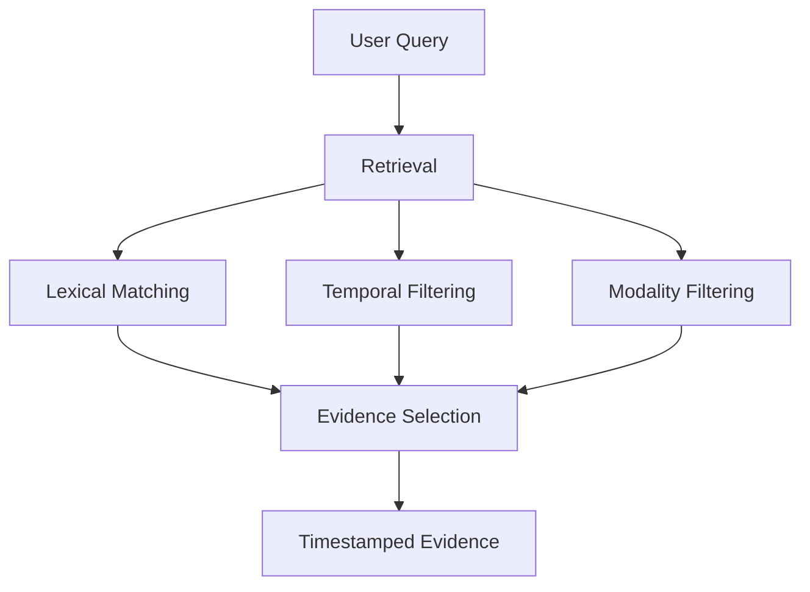

---

## AI Integration

VideoContext includes question answering over retrieved video evidence.

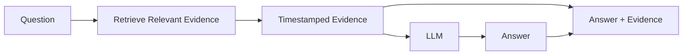

The `ask()` workflow is:

```text
Question
   ↓
Search
   ↓
Select Evidence
   ↓
Build Context
   ↓
LLM
   ↓
Answer + Evidence
```

The implementation instructs the LLM to answer only from the retrieved evidence and not invent timestamps or facts.

---

# Installation

## Core package

```bash
pip install videocontent
```

The core package is intentionally lightweight.

## Speech-to-text

```bash
pip install "videocontent[asr]"
```

## OCR

```bash
pip install "videocontent[ocr]"
```

## Vision adapters

```bash
pip install "videocontent[vision]"
```

## Vector retrieval

```bash
pip install "videocontent[vectors]"
```

## Embeddings

```bash
pip install "videocontent[embeddings]"
```

## REST API

```bash
pip install "videocontent[api]"
```

## MCP server

```bash
pip install "videocontent[mcp]"
```

## Main optional processing stack

```bash
pip install "videocontent[all]"
```

For development:

```bash
pip install -e ".[dev]"
```

---

# Requirements

VideoContext requires:

* Python 3.10 or newer
* FFmpeg available on your `PATH`

For OCR, Tesseract must also be installed.

For example:

```bash
brew install ffmpeg
brew install tesseract
```

On Debian or Ubuntu:

```bash
sudo apt install ffmpeg
sudo apt install tesseract-ocr
```

Check your environment:

```bash
videocontent doctor
```

The doctor command checks the available runtime capabilities, including:

* FFmpeg
* Tesseract
* faster-whisper
* FAISS
* sentence-transformers
* Registered providers

---

# Quick Start

## Process a video

```python
from videocontent import Video

video = Video("demo.mp4")

video.process()

video.save()
```

By default, `save()` writes:

```text
demo.mp4
   ↓
demo.vctx
```

You can also process and save in one workflow:

```python
import videocontent

video = videocontent.process(
    "demo.mp4",
    output=True,
)
```

---

# Search a Video

```python
from videocontent import Video

video = Video("demo.mp4")

video.process()

results = video.search(
    "pricing",
    top_k=5,
)

for hit in results.spans:
    print(hit.timecode)
    print(hit.modality)
    print(hit.text)
```

A search result contains timestamped evidence.

For example:

```text
00:18:21
transcript
The speaker begins discussing competitor pricing.

00:18:42
ocr
Competitor Pricing
```

---

# Search Specific Modalities

Restrict retrieval to particular sources.

Search speech and OCR:

```python
results = video.search(
    "competitor",
    modalities=[
        "transcript",
        "ocr",
    ],
    top_k=5,
)
```

Search OCR only:

```python
results = video.search(
    "pricing",
    modalities=["ocr"],
)
```

Search within a time range:

```python
results = video.search(
    "pricing",
    start=600,
    end=900,
)
```

---

# Inspect a Moment in the Video

Use `at()` to retrieve information associated with a particular point in time.

```python
snapshot = video.at("03:21")

for span in snapshot.spans:
    print(span.timecode)
    print(span.modality)
    print(span.text)
```

You can also use seconds:

```python
snapshot = video.at(201.0)
```

Or include nearby information:

```python
snapshot = video.at(
    "03:21",
    window=5,
)
```

---

# Load an Existing `.vctx`

Once a video has been processed, the original video is not required for retrieval.

```python
from videocontent import load

video = load("demo.vctx")

results = video.search("pricing")

for hit in results.spans:
    print(hit.timecode, hit.text)
```

This allows `.vctx` documents to be shared and queried independently of the original video.

---

# Ask Questions About a Video

VideoContext can retrieve evidence and use an LLM to answer questions.

```python
from videocontent import Video

video = Video("lecture.mp4")

video.process()

answer = video.ask(
    "What was the revenue mentioned in the video?"
)

print(answer.answer)
print(answer.confidence)

for evidence in answer.evidence:
    print(
        evidence.timecode,
        evidence.modality,
        evidence.text,
    )
```

You can restrict the modalities used for evidence:

```python
answer = video.ask(
    "What pricing was shown?",
    modalities=[
        "transcript",
        "ocr",
    ],
    top_k=5,
)
```

The answer object contains:

```text
question
answer
confidence
evidence
spans
```

---

# CLI

VideoContext provides two CLI entry points:

```bash
videocontent
```

and:

```bash
vctx
```

## Process a video

```bash
videocontent process demo.mp4
```

This creates:

```text
demo.vctx
```

Specify an output location:

```bash
videocontent process demo.mp4 \
  --output output.vctx
```

Write compressed output:

```bash
videocontent process demo.mp4 \
  --gzip
```

Machine-readable output:

```bash
videocontent process demo.mp4 \
  --json
```

---

## Inspect a `.vctx`

```bash
videocontent inspect demo.vctx
```

Inspect the transcript:

```bash
videocontent inspect demo.vctx \
  --transcript
```

Inspect OCR:

```bash
videocontent inspect demo.vctx \
  --ocr
```

Inspect events:

```bash
videocontent inspect demo.vctx \
  --events
```

Inspect segments:

```bash
videocontent inspect demo.vctx \
  --segments
```

Inspect everything:

```bash
videocontent inspect demo.vctx \
  --all
```

Machine-readable output:

```bash
videocontent inspect demo.vctx \
  --json
```

---

## Search

```bash
videocontent search \
  demo.vctx \
  "pricing"
```

Restrict results:

```bash
videocontent search \
  demo.vctx \
  "competitor" \
  --modality transcript \
  --modality ocr \
  --top-k 5
```

Search a time range:

```bash
videocontent search \
  demo.vctx \
  "pricing" \
  --from 10:00 \
  --to 15:00
```

JSON output:

```bash
videocontent search \
  demo.vctx \
  "pricing" \
  --json
```

---

## Inspect a Moment

```bash
videocontent at \
  demo.vctx \
  03:21
```

Include nearby evidence:

```bash
videocontent at \
  demo.vctx \
  03:21 \
  --window 5
```

---

## Ask Questions

```bash
videocontent ask \
  demo.vctx \
  "What was the revenue?"
```

Restrict the evidence:

```bash
videocontent ask \
  demo.vctx \
  "What pricing was discussed?" \
  --modality transcript \
  --modality ocr \
  --top-k 5
```

JSON output:

```bash
videocontent ask \
  demo.vctx \
  "What was the revenue?" \
  --json
```

---

## Check Your Environment

```bash
videocontent doctor
```

Machine-readable output:

```bash
videocontent doctor \
  --json
```

---

# The `.vctx` Format

`.vctx` is the central temporal context artifact used by VideoContext.

Conceptually:

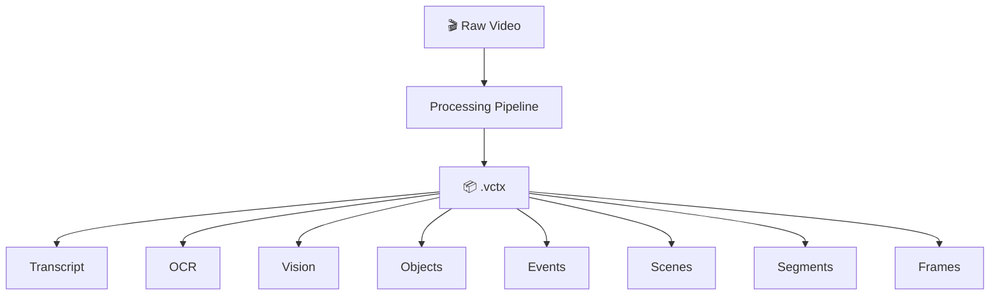

A `.vctx` document can contain information such as:

```json
{
  "vctx_version": "1.0",

  "video": {
    "duration": 62.4,
    "fps": 30.0,
    "width": 1280,
    "height": 720
  },

  "transcript": [],

  "ocr": [],

  "vision": [],

  "objects": [],

  "events": [],

  "scenes": [],

  "segments": [],

  "frames": []
}
```

The exact contents depend on the processing stages and providers used.

Read the complete specification:

[`.vctx` Format Specification](docs/VIDEO_CONTEXT_SPEC.md)

---

# Processing Architecture

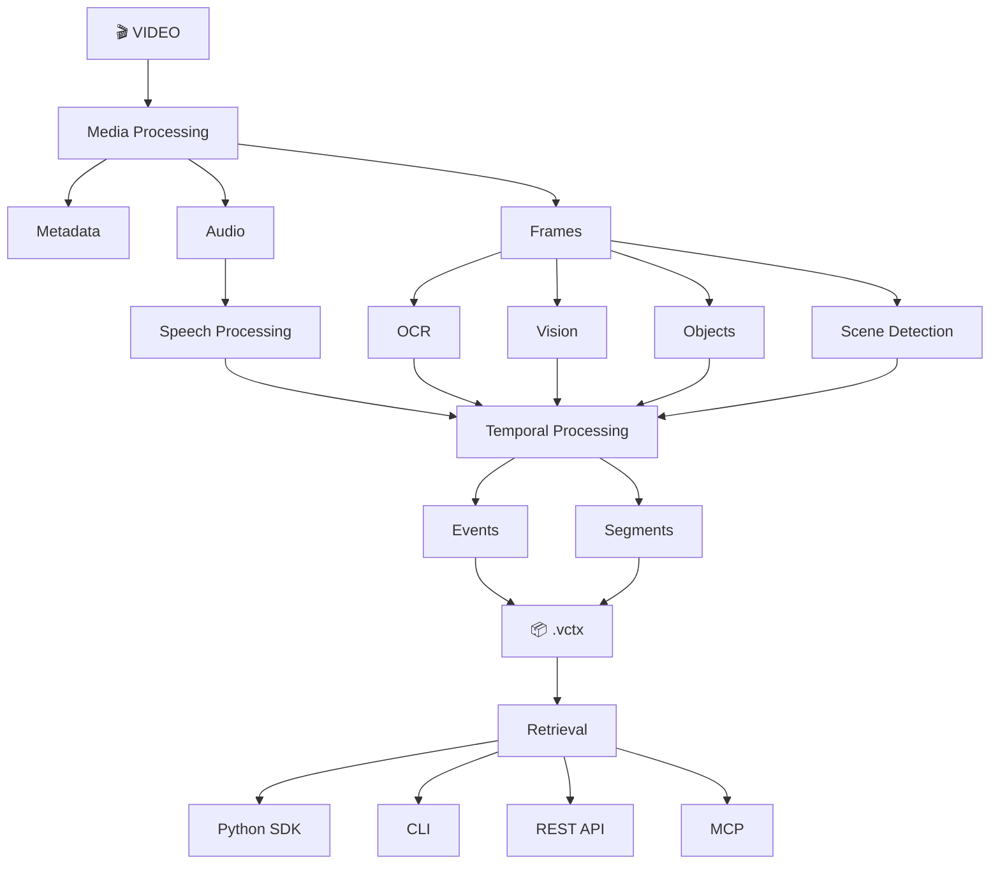

The `.vctx` document is the shared representation between the processing and retrieval layers.

---

# REST API

VideoContext includes a FastAPI application under:

```text
apps/api
```

Install API dependencies:

```bash
pip install "videocontent[api]"
```

Run the API:

```bash
uvicorn apps.api.main:app \
  --host 0.0.0.0 \
  --port 8000
```

The API provides:

```text
POST   /v1/videos
GET    /v1/videos/{video_id}

POST   /v1/videos/{video_id}/process
GET    /v1/videos/{video_id}/status

GET    /v1/videos/{video_id}/download

POST   /v1/videos/{video_id}/search
POST   /v1/videos/{video_id}/ask

GET    /v1/videos/{video_id}/timeline
GET    /v1/videos/{video_id}/segments
GET    /v1/videos/{video_id}/frames

GET    /health
GET    /ready
```

---

## Health Check

```bash
curl http://localhost:8000/health
```

Readiness:

```bash
curl http://localhost:8000/ready
```

---

## Upload a Video

```bash
curl -X POST \
  http://localhost:8000/v1/videos \
  -F "file=@demo.mp4"
```

The response includes a `video_id`.

---

## Process a Video

```bash
curl -X POST \
  http://localhost:8000/v1/videos/VIDEO_ID/process \
  -H "Content-Type: application/json" \
  -d '{}'
```

Processing configuration can also be supplied in the request body.

---

## Check Processing Status

```bash
curl \
  http://localhost:8000/v1/videos/VIDEO_ID/status
```

---

## Search Through the API

```bash
curl -X POST \
  http://localhost:8000/v1/videos/VIDEO_ID/search \
  -H "Content-Type: application/json" \
  -d '{
    "query": "pricing",
    "top_k": 5
  }'
```

Restrict modalities:

```bash
curl -X POST \
  http://localhost:8000/v1/videos/VIDEO_ID/search \
  -H "Content-Type: application/json" \
  -d '{
    "query": "competitor",
    "modalities": [
      "transcript",
      "ocr"
    ],
    "top_k": 5
  }'
```

---

## Ask a Question Through the API

```bash
curl -X POST \
  http://localhost:8000/v1/videos/VIDEO_ID/ask \
  -H "Content-Type: application/json" \
  -d '{
    "question": "What pricing was discussed?",
    "top_k": 5
  }'
```

The response contains:

* Question
* Answer
* Confidence
* Evidence

---

## Get Timeline Information

```bash
curl \
  http://localhost:8000/v1/videos/VIDEO_ID/timeline
```

Restrict the time range:

```bash
curl \
  "http://localhost:8000/v1/videos/VIDEO_ID/timeline?start=60&end=120"
```

---

# MCP Server

VideoContext includes a Model Context Protocol server under:

```text
apps/mcp
```

Install MCP dependencies:

```bash
pip install "videocontent[mcp]"
```

The MCP server exposes processed video context to MCP-compatible AI applications and agents.

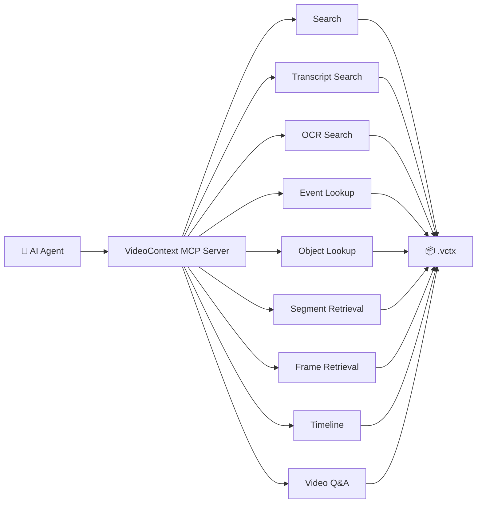

The available tools are:

```text
search_video
search_transcript
search_ocr

find_event
find_object

get_segment
get_frame
get_timeline

ask_video
```

---

## `search_video`

Search across available modalities.

Example input:

```json
{
  "video_id": "VIDEO_ID",
  "query": "pricing",
  "top_k": 10
}
```

---

## `search_transcript`

Search speech only.

```json
{
  "video_id": "VIDEO_ID",
  "query": "revenue",
  "top_k": 10
}
```

---

## `search_ocr`

Search on-screen text.

```json
{
  "video_id": "VIDEO_ID",
  "query": "pricing",
  "top_k": 10
}
```

---

## `find_event`

Find events by type.

```json
{
  "video_id": "VIDEO_ID",
  "event_type": "slide_changed"
}
```

---

## `find_object`

Find detected objects.

```json
{
  "video_id": "VIDEO_ID",
  "label": "person"
}
```

---

## `get_segment`

Retrieve a segment.

```json
{
  "video_id": "VIDEO_ID",
  "segment_id": "SEGMENT_ID"
}
```

---

## `get_frame`

Retrieve frame metadata.

```json
{
  "video_id": "VIDEO_ID",
  "frame_id": "FRAME_ID"
}
```

---

## `get_timeline`

Retrieve timeline information.

```json
{
  "video_id": "VIDEO_ID",
  "start": 60,
  "end": 120
}
```

---

## `ask_video`

Ask a question about processed video context.

```json
{
  "video_id": "VIDEO_ID",
  "question": "What was the main pricing discussion?",
  "top_k": 5
}
```

The MCP server returns the answer together with evidence from the video context.

---

# Web Application

VideoContext includes a web application under:

```text
apps/web
```

The web application is built with:

* React
* TypeScript
* Vite
* Tailwind CSS

Install dependencies:

```bash
cd apps/web

npm install
```

Run the development server:

```bash
npm run dev
```

Build for production:

```bash
npm run build
```

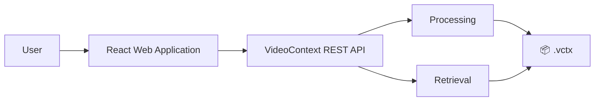

---

# Configuration

VideoContext uses `ProcessingConfig`.

```python
from videocontent import ProcessingConfig, Video

config = ProcessingConfig()

video = Video(
    "lecture.mp4",
    config=config,
)

video.process()
```

Configuration can also be provided through CLI configuration and overrides.

Example:

```bash
videocontent \
  --set sampling.mode=adaptive \
  process demo.mp4
```

The CLI also supports a YAML configuration file:

```bash
videocontent \
  --config config.yaml \
  process demo.mp4
```

---

# Provider Architecture

VideoContext separates the core representation from the implementations used to process and query video.

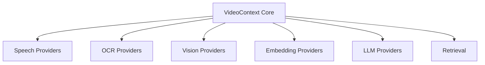

The project contains provider and registry infrastructure that allows different implementations to be used without changing the central temporal representation.

---

# Project Architecture

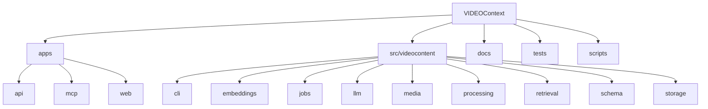

The applications and core library are separated.

The main package lives under:

```text
src/videocontent
```

Applications live under:

```text
apps/
```

---

# Development

Clone the repository:

```bash
git clone https://github.com/AAGAM17/VIDEOContext.git

cd VIDEOContext
```

Install development dependencies:

```bash
pip install -e ".[dev]"
```

Run the test suite:

```bash
pytest
```

The repository uses:

* `pytest`
* `ruff`
* `mypy`

Run Ruff:

```bash
ruff check src tests
```

Run MyPy:

```bash
mypy
```

---

# Documentation

The repository includes additional technical documentation.

## Architecture

[docs/ARCHITECTURE.md](docs/ARCHITECTURE.md)

Describes the project architecture and design decisions.

## `.vctx` Specification

[docs/VIDEO_CONTEXT_SPEC.md](docs/VIDEO_CONTEXT_SPEC.md)

Describes the temporal context document format.

## Roadmap

[docs/ROADMAP.md](docs/ROADMAP.md)

Describes the planned development direction.

---

# Project Status

**Version: 0.1.0**

VideoContext is currently in the Alpha stage.

The current repository includes:

* Core Python package
* Video processing pipeline
* `.vctx` temporal context format
* Speech processing infrastructure
* OCR infrastructure
* Vision infrastructure
* Object information
* Event information
* Scene information
* Temporal segmentation
* Retrieval
* Python SDK
* CLI
* LLM-backed question answering
* REST API
* MCP server
* React web application
* Tests
* Documentation
* Development tooling

The project is actively evolving.

See the [Roadmap](docs/ROADMAP.md) for planned development.

---

# Contributing

Contributions are welcome.

If you would like to contribute:

1. Fork the repository.
2. Create a branch for your changes.
3. Make the changes.
4. Add or update tests where appropriate.
5. Run the existing test suite.
6. Open a pull request describing your changes.

Useful areas for contributions include:

* Video processing
* Speech-to-text
* OCR
* Vision providers
* Object detection
* Event extraction
* Embeddings
* Retrieval
* LLM integrations
* MCP integrations
* API development
* Web application development
* Performance
* Testing
* Documentation

For larger architectural changes, opening an issue or discussion first can help align the implementation with the existing project structure.

---

# License

VideoContext is licensed under the Apache License 2.0.

See [LICENSE](LICENSE).

---

<div align="center">

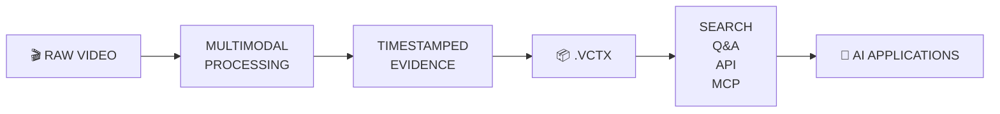

## Process once. Query repeatedly.

### VideoContext turns video into reusable, searchable temporal context.

</div>
